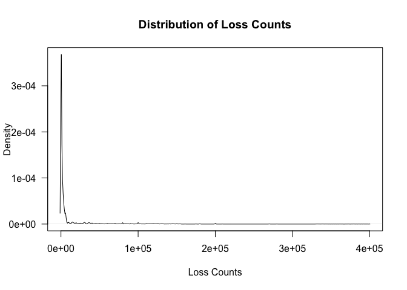

Codebook
================

## Description

These data describe estimates of casualties, fatalities, and equipment
losses in Ukraine during the first year (2022–2023) of the invasion by
Russia. The data were collected by graduate and undergraduate students
during and immediately following this time period.

## Variable Descriptions

- `days` (integer): The number of days following the initial invasion
  date, Feb. 24, 2022.  
- `loss_count` (integer): The estimated number of losses of that type.  
- `loss_type` (string): The type of equipment (or casualty) that the
  estimate apply to.  
- …

``` r
plot(density(data$loss_count),
     xlab="Loss Counts",
     ylab="Density",
     las=1,
     main="Distribution of Loss Counts")
```

<!-- -->

|       | Header 1 | Header 2 |
|-------|----------|:--------:|
| Row 1 | a        |    b     |
| Row 2 | c        |    d     |
